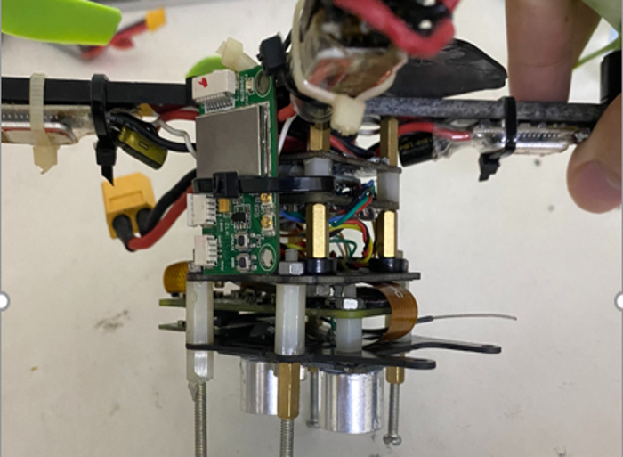
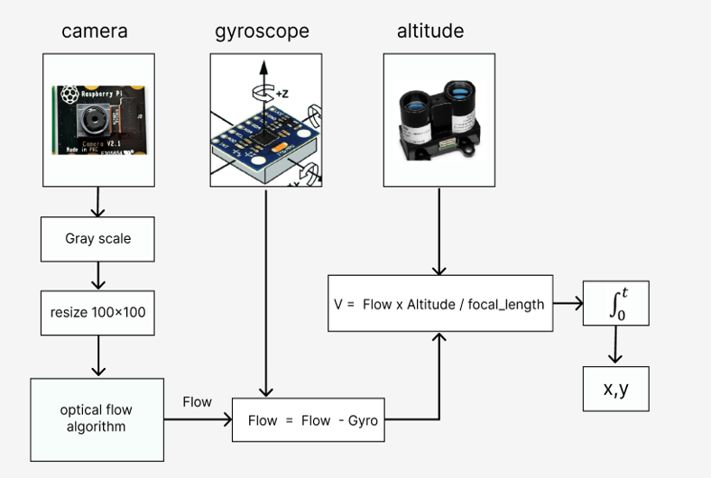
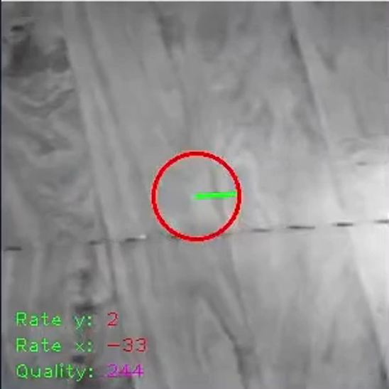
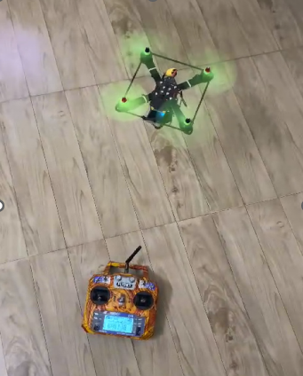
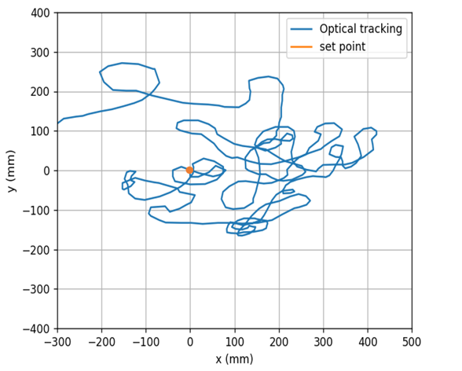

# flow-piCamera
<<<<<<< HEAD
Xác định chuyển động của Quadrotor so với mặt phẳng tham chiếu sử dụng Raspberrypi và camera ứng dụng giữ vị trí cho Quadrotor. Raspberrypi chuyền dữ liệu đến mạch điều khiển bay thông qua cổng UART với chu kì 20 Hz, dữ liệu sau đó được mạch điều khiển bay xử lý và hiệu chuẩn trước khi đưa vào bộ điều khiển. 

Sơ đồ khối xử lý Flow

## Phần cứng
- raspberrypi zero
- pi camera v1
- Quadrotor 2.5 inch
- cảm biến siêu âm SR-04
- mpu6050
- flight controller stm32f103

 

Vị trí bay theo thời gian

### Bay thử nghiệm
https://www.youtube.com/watch?v=89pcLAhuY8Y

=======
Xác định chuyển động sử dụng Raspberrypi và camera ứng dụng giữ vị trí cho Quadrotor. Raspberrypi chuyền dữ liệu đến mạch điều khiển bay
thông qua cổng UART với chu kì 20 Hz, dữ liệu sau đó được mạch điều khiển bay xử lý và hiệu chuẩn 
# Phần cứng
raspberrypi zero,
pi camera v1
Thử nghiệm thuật toán              |  Bay thử nghiệm https://www.youtube.com/watch?v=89pcLAhuY8Y
:-------------------------:|:-------------------------:
  |
# Vị trí theo thời gian

>>>>>>> dddcc5be3ad584db84b75f6f7729a8a0b40c1133
