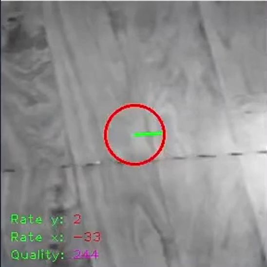
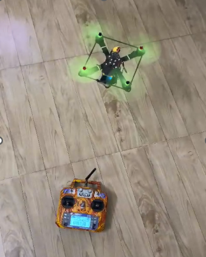
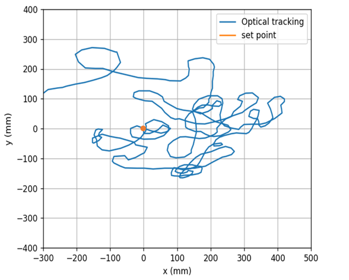

# flow-piCamera
Xác định chuyển động sử dụng Raspberrypi và camera ứng dụng giữ vị trí cho Quadrotor. Raspberrypi chuyền dữ liệu đến mạch điều khiển bay
thông qua cổng UART với chu kì 20 Hz, dữ liệu sau đó được mạch điều khiển bay sử lý, hiệu chuẩn 
# Phần cứng
raspberrypi zero,
pi camera v1
Thử thuật toán              |  Bay thử nghiệm
:-------------------------:|:-------------------------:
  |
# Vị trí theo thời gian

# Bay thử nghiệm
https://www.youtube.com/watch?v=89pcLAhuY8Y

